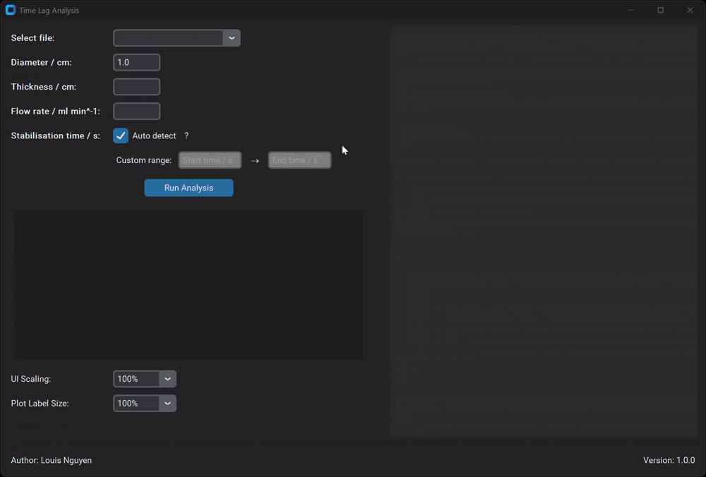

# Time Lag Analysis Application

This application provides a user-friendly interface for analysing gas permeation data using the time lag method. Load data from Excel files in `data`, specify your experimental setup, run the analysis, and visualise the results.

{: .no-caption style="display:block; margin:auto; width:86%"}

This exemplar was developed at Imperial College London by Louis Nguyen in collaboration with Dr. Diego Alonso Alvarez from Research Software Engineering and Dr. Chris Cooling from Research Computing & Data Science at the Early Career Researcher Institute.

## Learning Outcomes 🎓

By using this application, you will:

-   Gain an understanding of time lag analysis in gas permeation experiments.
-   Learn how to prepare and analyse your experimental data.
-   Get hands-on experience with a GUI for scientific data analysis.
-   Be able to adapt the application to your specific research interests.

## Target Audience 🎯

This exemplar is aimed at researchers, students, and engineers in fields such as Chemical Engineering, Materials Science, and Polymer Science who work with gas or vapor permeation through membranes and films. It is suitable for those who need to:

- Analyse experimental permeation data.
- Understand the principles of the time-lag method.
- Learn how to implement data analysis workflows in Python.
- Utilise a graphical user interface for scientific computation.

## Disciplinary Background 🔬

The time-lag method is a widely used experimental technique to determine the diffusion and permeability coefficients of gases or vapours in polymeric membranes. This information is crucial for designing and optimising materials for various applications, such as gas separation, packaging, and protective coatings. This exemplar provides a practical tool and learning resource for performing time-lag analysis, bridging the gap between experimental data acquisition and material property characterisation. It can be useful for researchers in materials science, chemical engineering, polymer chemistry, and any field involving the study of transport phenomena in materials.

## Prerequisites ✅

### Academic 📚

- Basic understanding of mass transfer principles and gas permeation in materials.
- Familiarity with data handling (e.g., using spreadsheets like Excel).
- Some experience with Python programming is beneficial for extending the application or understanding the source code, but not strictly required for using the GUI.

### System 💻

- Anaconda or Miniconda installed on your system.
- Git (optional, for cloning the repository).
- Python 3.12+.

## Software Tools 🛠️

- Programming language: Python
- Core libraries:
    - NumPy: For numerical operations.
    - Pandas: For data manipulation and analysis, especially with Excel files.
    - SciPy: For scientific and technical computing, including curve fitting and optimisation.
    - Matplotlib: For creating static, interactive, and animated visualisations.
- GUI: CustomTkinter
- Environment management: Conda

## Getting Started 🚀

1.  Clone or download the repository:

    ```bash
    git clone https://github.com/ImperialCollegeLondon/ReCoDe-permeation-analysis-app
    cd ReCoDe-permeation-analysis-app
    ```
2.  Create and activate the `permeation-env` conda environment:

    ```bash
    conda env create -f environment.yml
    conda activate permeation-env
    ```
3.  Run the application:

    ```bash
    python src/app.py
    ```

The application interface allows you to:

1.  Load data: Use the provided example data or upload your own Excel files from the `data` directory.
2.  Specify parameters: Input your experimental setup details.
3.  Run analysis: Click the `Run Analysis` button to process the data.
4.  View results:
    *   Numerical results will appear in the designated text box.
    *   Visualisations (plots) will be displayed on the right-hand panel.
    *   Save plots using the "Save" button located at the top right of the plot area.


## Data 📊

Example datasets are provided in the `data/` directory. These are Excel files (`.xlsx`) representing typical raw data from gas permeation experiments.

- Licensing: The provided data may be synthetic or anonymised for demonstration purposes within this exemplar. This data remains the property of the original owner, and permission must be sought for any use outside of this exemplar.
- Location: Included directly in the repository under the `data/` folder.

## Documentation Guide

1. Explore the documentation in the `docs` folder, starting with [`01-Home.md`](docs/01-Home.md) and progressing through the guides.
2. Work through the exercises in [`09-Exercises-and-Best-Practices.md`](docs/09-Exercises-and-Best-Practices.md).

## Estimated Time ⏳

| Task                                                                 | Time     |
| -------------------------------------------------------------------- | -------- |
| [Introduction](docs/01-Home.md)                                       | 20 mins  |
| [Understanding Theoretical Background](docs/02-Theoretical-Background.md)                     | 30 mins  |
| [Data Management and Processing](docs/03-Data-Management-and-Processing.md)             | 25 mins  |
| [Time Lag Analysis Implementation](docs/04-TimelagAnalysis-Implementation.md)             | 25 mins  |
| [Python PDE Implementation](docs/05-Python-PDE-Implementation.md)                  | 25 mins  |
| [Visualisation Techniques](docs/06-Visualisation.md)                              | 20 mins  |
| [GUI Implementation](docs/07-GUI-Implementation.md)                       | 15 mins  |
| [Application Workflow](docs/08-Application-Workflow.md)                       | 20 mins  |
| **Subtotal: Core Documentation**                                     | **3 hours** |
| [Exercises and Best Practices](docs/09-Exercises-and-Best-Practices.md)               | 3 hours  |
| **Total Estimated Time**                                             | **6 hours** |

## Project Structure 🗂️

```
.
├── data/                      # Example Excel data files for demonstration
├── docs/                      # Markdown documentation and guides
│   ├── assets/                # Images and other assets for documentation
│   ├── 01-Home.md
│   ├── 02-Theoretical-Background.md
│   ├── 03-Data-Management-and-Processing.md
│   ├── 04-TimelagAnalysis-Implementation.md
│   ├── 05-Python-PDE-Implementation.md
│   ├── 06-Visualisation.md
│   ├── 07-GUI-Implementation.md
│   ├── 08-Application-Workflow.md
│   ├── 09-Exercises-and-Best-Practices.md
│   └── index.md               # Main index for MkDocs
├── notebooks/                 # (Currently empty, could be used for Jupyter notebooks)
├── src/                       # Source code for the application
│   ├── __init__.py            # Initialises the src package
│   ├── app.py                 # Main application file (GUI implementation)
│   ├── calculations.py        # Functions for time lag calculations
│   ├── data_processing.py     # Functions for loading and preprocessing data
│   ├── time_lag_analysis.py   # Workflow for performing time lag analysis
│   ├── util.py                # Utility functions and plot styling
│   └── visualisation.py       # Functions for creating plots
├── tests/                     # (Planned, to house test scripts)
├── environment.yml            # Conda environment specification
├── LICENSE.md                 # Project license
├── mkdocs.yml                 # Configuration for MkDocs
├── README.md                  # This file
├── requirements-dev.txt       # Development dependencies (e.g., for MkDocs)
└── requirements.txt           # Core Python package dependencies
```

Code is organised into logical components:

- `data`: Contains example experimental data files.
- `docs`: Houses all user documentation, guides, and supporting images.
- `src`: Contains the core Python scripts for the application's logic, calculations, data processing, and GUI.
- `notebooks`: Reserved for potential Jupyter Notebooks for interactive exploration or tutorials.
- `tests`: Reserved for future test scripts.

## Best Practice Notes 📝

- Reproducible environments: The `environment.yml` file ensures that users can create an identical Conda environment with all necessary dependencies.
- Modular code: The source code in `src/` is organised into modules with specific responsibilities (e.g., `data_processing.py`, `calculations.py`, `visualisation.py`, `app.py`).
- Documentation: Comprehensive documentation is provided in the `docs/` folder, built with MkDocs.
- Code comments: The Python scripts include comments to explain the logic.
- User-friendly GUI: The application features a GUI to make the analysis accessible to users without extensive programming knowledge.
- Future:
    - Code testing: Implementing unit and integration tests in the `tests/` directory.
    - Continuous Integration (CI): Setting up CI pipelines for automated testing.

## Additional Resources 🔗

- The `docs/` folder within this repository contains detailed guides and explanations.
- For specific Python libraries, refer to their official documentation:
    - [NumPy](https://numpy.org/doc/)
    - [Pandas](https://pandas.pydata.org/docs/)
    - [SciPy](https://docs.scipy.org/doc/scipy/)
    - [Matplotlib](https://matplotlib.org/stable/contents.html)
    - [Tkinter](https://docs.python.org/3/library/tkinter.html)

## License 📄

This project is licensed under the [BSD-3-Clause license](LICENSE.md).
