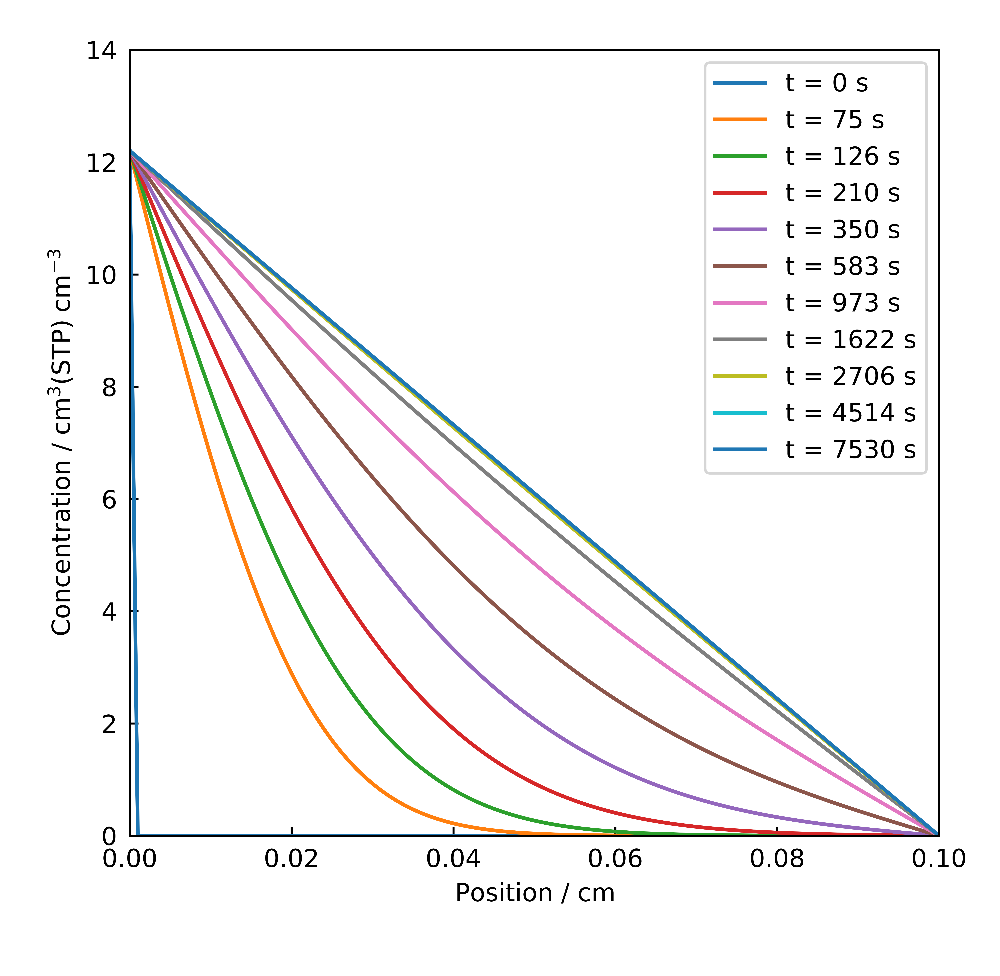

# Time Lag Analysis: A Theoretical Foundation

## TLDR
The time lag method determines a material's diffusion coefficient $(D)$ and solubility coefficient $(S)$ from a single gas permeation experiment. Plotting cumulative permeated flux versus time reveals a linear steady-state region. Extrapolating this line to the time axis yields the 'time lag' $(\theta)$, allowing calculation of the diffusion coefficient: $D = L^2 / (6\theta)$, where $L$ is membrane thickness. The slope of the steady-state line relates directly to the permeability $(P)$, and since $P = D \times S$, the solubility coefficient is found via $S = P/D$. This technique, pioneered by Daynes (1920) and Barrer (1939), is fundamental for characterising gas transport in membranes.

## Introduction to Gas Transport Phenomena

Gas transport through membranes is a fundamental process in many areas of chemical engineering, materials science, and environmental applications. Understanding and quantifying this transport is essential for designing materials for gas separation, barrier materials, and controlled release systems. The gas-polymer system uses throughout this exemplar is carbon dioxide (CO$_2$) in High-Density Polyethylene (HDPE).

## The Permeation Experiment

A typical gas permeation experiment involves placing a membrane sample between two chambers. One chamber (upstream) is pressurized with the gas of interest, while the other chamber (downstream) is kept at a low pressure, often by using a sweep gas. The amount of gas that permeates through the membrane to the downstream side is then measured over time.

The key steps of the experiment include:

1. A gas is introduced on one side of a membrane at time $t=0$. The downstream pressure is maintained by using a continuously sweeping flow of nitrogen (N$_2$). This ensures the concentration at the downstream face of the membrane remains effectively zero.
2. The gas flux through the membrane is measured over time on the permeate side.
3. Initially, there is a transient state as the concentration profile develops in the membrane.
4. Eventually, a steady-state is reached with a constant flux.

These key steps are illustrated in Figure 1. 

{: style="display:block; margin:auto; width:86%"}

*Figure 1: Schematic representation of the permeation of CO$_2$ through a polymer membrane.*

The time lag method enables a single value of diffusion coefficient to be calculated based on the measured flux. This is because the transition from the initial transient state (step 3) to steady-state flux (step 4) becomes apparent when plotting the cumulative permeated gas versus time. Extrapolating the linear steady-state portion of this curve yields the time lag, the basis for calculating the diffusion coefficient, as explained in the sections below.

## The Time Lag Method

The time-lag method was first developed and applied to gas diffusion studies in the early 20th century by Daynes [1] and further developed by Barrer [2].

These works established the theoretical foundation that remains the basis for contemporary membrane permeation analysis.

The time-lag method is a technique used to determine two key transport parameters simultaneously:

- Diffusion coefficient $(D)$
- Solubility coefficient $(S)$

Together, these parameters determine the material's permeability:

$$P = D \times S$$

## Theoretical Background

### Fick's Laws and Boundary Conditions

The time-lag method is based on Fick's laws of diffusion:

1. **Fick's First Law**: 

   This relates the diffusive flux to the concentration gradient.
   
   $$J = -D \frac{\partial C}{\partial x}$$

   where:
   
   - $J$ is the diffusion flux 
   - $D$ is the diffusion coefficient 
   - $C$ is the concentration 
   - $x$ is position 

2. **Fick's Second Law**: 
   
   This describes how concentration changes with time due to diffusion.

   $$\frac{\partial C}{\partial t} = D \frac{\partial^2 C}{\partial x^2}$$

3. Boundary Conditions:

   For a membrane of thickness $L$:

   - $C(0,t) = C_{eq}$ (upstream side concentration)
   - $C(L,t) = 0$ (downstream side concentration, assumed to be perfectly evacuated)
   - $C(x,0) = 0$ (initial condition: no gas in membrane)

Figures 2 and 3 below visualise the solution to Fick's Second Law for the specified boundary conditions, obtained using the numerical methods described in [`05-Python-PDE-Implementation`](05-Python-PDE-Implementation.md). Figure 2 presents the concentration evolution $C(x,t)$ as a heatmap, while Figure 3 shows concentration profiles $C(x)$ at discrete time points. These specific plots correspond to the parameters derived from the `RUN_H_25C-100bar_9.csv` dataset.

{: style="display:block; margin:auto; width:86%"}

*Figure 2: Concentration profile evolution over time.*

{: style="display:block; margin:auto; width:86%"}

*Figure 3: Concentration profiles at specific time points.*

Observing the figures provides insights into the diffusion process governed by Fick's laws and the specified conditions:

* Fixed ends (boundary conditions):
   * Figure 2: The bright red color along the left edge ($x=0$) shows the constant high gas concentration $(C_{eq})$ maintained on the upstream side. The dark blue color along the right edge ($x=L$) shows the near-zero concentration maintained on the downstream side.
   * Figure 3: Every concentration line starts at the high value $C_{eq}$ on the left ($x=0$) and drops to zero on the right ($x=L$). This confirms the fixed concentrations at the membrane boundaries throughout the experiment.

* Empty start  (initial condition):
   * Figure 2: The bottom edge of the heatmap (representing $t=0$) is blue across the membrane width (for $x>0$), indicating that initially, there was no gas dissolved in the membrane.
   * Figure 3: The "t=0" line is flat at zero concentration (except for the upstream boundary at $x=0$), showing the initial empty state of the membrane.

* Gas spreading over time (transient diffusion):
   * Figure 2: As you move upwards (increasing time), the color gradient (from red to blue) moves across the membrane from left to right. This indicates the gas gradually diffusing through the material.
   * Figure 3: The lines for early times (such as t=75s and t=126s) are steeply curved, especially near the left side ($x=0$). This shows that the concentration is changing rapidly as the gas first enters and spreads.

* Reaching a balance (steady state):
   * Figure 2: At later times (towards the top of the heatmap), the color pattern stops changing significantly with time. The gradient becomes stable.
   * Figure 3: The concentration lines become less curved over time. The line for t=7530s is almost perfectly straight. A straight line profile indicates that the rate of gas entering and leaving any section of the membrane has become constant – this is the steady state.

### The Time Lag Derivation

{: style="display:block; margin:auto; width:86%"}

*Figure 4:  Graphical determination of the time lag $(\theta)$ by extrapolating the linear steady-state region of the cumulative flux curve to the time axis [3].*

When gas permeation reaches steady state, the cumulative amount of gas that has permeated through the membrane $(Q_{t})$ follows:

$$Q_{t} = \frac{DC_1}{L}\left(t - \frac{L^2}{6D}\right)$$

The time-lag $(\theta)$ is determined graphically by extrapolating the linear steady-state portion of the cumulative flux curve to the time axis (x-intercept), as illustrated in Figure 4. This time lag is related to the diffusion coefficient $(D)$ and membrane thickness $(L)$ by the equation:

$$\theta = \frac{L^2}{6D}$$

Therefore:

$$D = \frac{L^2}{6\theta}$$

The permeability $(P)$ is related to the steady-state flux $(J_{\infty})$ and pressure difference $(\Delta p)$ :

$$ P = \frac{L \times J_{\infty}}{\Delta p} $$

The solubility coefficient $(S)$ can be calculated from $P$ and $D$ based on the definition for $P$ $(P = S \times D)$:

$$S = \frac{P}{D}$$

Upstream solubility $(C_{eq})$ can be calculated:

$$C_{eq} = S \times {\Delta p}$$

## Units and Conventions

In this application, we use the following units:

- Length: centimeters [cm]
- Time: seconds [s]
- Pressure: bar [bar]
- Amount of substance: standard cubic centimeters at "Standard Temperature and Pressure" [cm³(STP)]. This unit, representing the volume a quantity of gas would occupy at STP (0°C, 1 atm), functions as a measure of amount (like moles). Although an older convention, it remains prevalent in membrane science and engineering, and is therefore used throughout this exemplar.

The key parameters have these units:

- Time lag $(\theta)$: [s]
- Diffusion coefficient $(D)$: [cm²/s]
- Permeability $(P)$: [cm³(STP)·cm/(cm²·s·bar)]
- Solubility coefficient $(S)$: [cm³(STP)/(cm³·bar)]
- Solubility $(C_{eq})$: [cm³(STP)/cm³]

## Significance and Applications

The time lag method provides:

- A straightforward way to determine both diffusion and solubility coefficients
- Insights into the transport mechanisms through polymers and other materials
- Data essential for designing gas separation membranes, food packaging, and barrier materials

In this application, we implement the time lag method for analysing experimental permeation data and visualising the results, providing a computational tool that researchers can use and adapt to their specific needs.

## Limitations of the Time Lag Method

While the time lag method is a powerful technique, it has several important limitations that should be considered:

1. Constant diffusion coefficient assumption: The classical time lag method assumes that the diffusion coefficient is concentration-independent. For materials with strong gas-polymer interactions, this assumption may not hold, leading to inaccurate results.
2. Steady-state requirement: Accurate time lag determination requires reaching true steady-state conditions. Premature termination of experiments can lead to incorrect extrapolation and inaccurate diffusion coefficients.
3. Downstream boundary condition: The method requires maintaining near-zero concentration at the downstream membrane face. Insufficient sweep gas flow or downstream accumulation can violate this condition, compromising time lag accuracy.

These limitations highlight the importance of careful experimental design and thoughtful interpretation of results when using the time lag method for membrane characterisation.

## Bibliography

[1] Daynes, H.A. "The process of diffusion through a rubber membrane." *Royal Society Proceedings*, 97 (1920), pp. 286-307.

[2] Barrer, R.M. "Permeation, diffusion and solution of gases in organic polymers." *Transactions of the Faraday Society*, 35 (1939), pp. 628-643.

[3] Paul, D.R. "Time Lag Method for Mass Transport Properties Evaluation in GS." In: Drioli, E., Giorno, L. (eds) *Encyclopedia of Membranes*. Springer, Berlin, Heidelberg (2016).