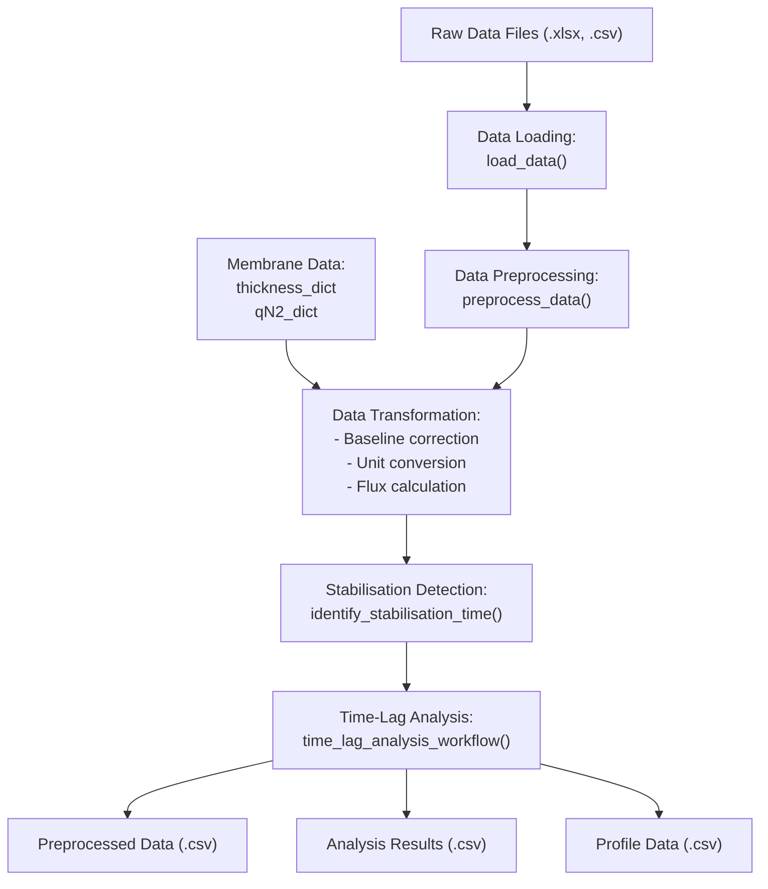

# Data Management and Processing

## Data Management in Research

### Best Practices for Experimental Data Management

Good data management is essential for reproducible research. When working with experimental data, consider these practices:

1. **Consistent file naming**: Use descriptive, consistent naming schemes (e.g., `RUN_H_25C-100bar_7.xlsx` clearly indicates temperature and pressure conditions).
2. **Data organisation**: Organise data in a logical folder structure with clear separation between raw data and processed outputs.
3. **Metadata recording**: Document experimental conditions, sample details, and measurement parameters.
4. **Version control**: Track changes to your data processing scripts using version control systems such as Git.
5. **Data backup**: Regularly back up your research data to prevent loss. Utilise cloud storage services (like OneDrive) when possible.

### Data Structure for Time-Lag Analysis

For permeation experiments specifically, data should include:

- Time measurements (seconds)
- Pressure readings (bar or barg)
- Temperature readings (°C)
- Gas concentration measurements (ppm)
- Flow rates (ml/min)
- Sample dimensions (thickness, diameter)

## Data Processing Workflow

The application implements a data processing pipeline in `data_processing.py` consisting of several key steps:

### 1. Loading Data

Raw experimental data is loaded from Excel files using the `load_data` function.

### 2. Data Preprocessing

The `preprocess_data` function performs several preprocessing steps:
1. **Baseline correction**: Remove background signals from gas concentration measurements.
```python
df['y_CO2_bl / ppm'] = df['y_CO2 / ppm'] - baseline
```
2. **Pressure conversion**: Convert pressure readings to standard units (bar).
```python
df['P_cell / bar'] = df['P_cell / barg'] + 1.01325
```
3. **Flux calculation**: Calculate gas flux through the membrane from provided polymer disc thickness (`d_cm`) and N₂ sweeping gas flowrate (`qN2_mlmin`).
```python
# Calculate Area of disc
A_cm2 = (math.pi * d_cm**2) / 4 # [cm^2]

# Specify mass flow rate of N2 in [ml/min]
if qN2_mlmin is not None:
    df['qN2 / ml min^-1'] = qN2_mlmin
elif 'qN2 / ml min^-1' not in df.columns:
    raise ValueError("Column 'qN2 / ml min^-1' does not exist in the DataFrame.")

# Calculate flux
if unit == 'cm^3 cm^-2 s^-1' or unit == 'None':
    df['flux / cm^3(STP) cm^-2 s^-1'] = (df['qN2 / ml min^-1'] / 60) * (df['y_CO2_bl / ppm'] * 1e-6) / A_cm2
```
4. **Cumulative flux calculation**: Integrate experimental flux over time to obtain cumulative flux.
```python
df['cumulative flux / cm^3(STP) cm^-2'] = (df['flux / cm^3(STP) cm^-2 s^-1'] * df['t / s'].diff().fillna(0)).cumsum()
```

### 3. Stabilization Time Detection

An important aspect of time-lag analysis is determining when steady-state diffusion has been reached. This is performed in `identify_stabilisation_time` function. The following steps are performed:
1. Calculates the gradient of the specified data column.
```python
df['gradient'] = (df[column].diff() / df['t / s'].diff())
```
2. Examines changes in this gradient over a rolling window.
```python
df['pct_change_mean'] = (df[column].diff() / df['t / s'].diff()).pct_change().abs().rolling(window=window).mean()
df['pct_change_min'] = (df[column].diff() / df['t / s'].diff()).pct_change().abs().rolling(window=window).min()
df['pct_change_max'] = (df[column].diff() / df['t / s'].diff()).pct_change().abs().rolling(window=window).max()
df['pct_change_median'] = (df[column].diff() / df['t / s'].diff()).pct_change().abs().rolling(window=window).median()
```
3. Identifies when changes fall below a specified threshold.
```python
stabilisation_index = df[((df['pct_change_mean'] <= threshold))].index[0]
stabilisation_time = df.loc[stabilisation_index, 't / s']
```

## Input, Output, and Configuration

### Data Input
The application expects data files in the `data/` directory with experimental data organised in Excel files. Sample data files are available in this location for reference.

```
data/
    RUN_H_25C-100bar_7.xlsx
    RUN_H_25C-100bar_8.xlsx
    RUN_H_25C-100bar_9.xlsx
    RUN_H_25C-200bar_2.xlsx
    RUN_H_25C-50bar.xlsx
    ...
```

When using the application, ensure your data files adhere to the following specifications:

1. Required columns: Each file must contain, at minimum, the following data columns with the specified headers:
    *   `t / s`: Time, measured in seconds.
    *   `P_cell / barg`: Cell pressure, measured in bar gauge.
    *   `T / °C`: Temperature, measured in degrees Celsius.
    *   `y_CO2 / ppm`: Carbon dioxide concentration, measured in parts per million.

2. Unit consistency: Ensure that units are consistent across all measurements within and between files intended for comparative analysis.

3.  File format: Data must be provided in either Excel (`.xlsx`, `.xls`) or CSV (`.csv`) format.

### Output Data

Following the pre-processing steps in `preprocess_data.py`, the main analysis is performed in `calculation.py` (explained in depth in `04-TimelagAnalysis-Implementation`). These steps are encompassed in the complete workflow function `time_lag_analysis_workflow` in `time_lag_analysis.py`. The workflow will be explained in depth in `08-Application-Workflow`. This workflow can generate several output files:

1. **Preprocessed data**: Contains the cleaned and transformed experimental data.
2. **Time lag analysis results**: Contains the calculated parameters (diffusion coefficient, permeability, etc.).
3. **Concentration profiles**: Shows how gas concentration changes with position and time.
4. **Flux profiles**: Shows the calculated gas flux over time.

### Experimental Metadata Configuration

The `util.py` file contains configuration dictionaries for experimental parameters:

```python
thickness_dict = {
    'RUN_H_25C-50bar': 0.1, 'RUN_H_25C-100bar_7': 0.1, 
    # ... other thickness values
} # [cm]

qN2_dict = {
    'RUN_H_25C-50bar': 8.0, 'RUN_H_25C-100bar_7': 8.0,
    # ... other flow rate values
}  # [ml min^-1]
```

The dictionaries provide essential metadata for each experiment:
- `thickness_dict`: Membrane thickness in cm
- `qN2_dict`: Nitrogen flow rate in ml/min

This separation centralises the metadata in `util.py`, enhancing maintainability. It ensures consistency and simplifies updates across the analysis. For example, when calculating permeability for `'RUN_H_25C-100bar_7'`, the code retrieves the thickness `0.1` directly from `thickness_dict`. If this value needed correction, it would only require changing it once in `util.py`.


## Data Flow Diagram




## Extending the Data Processing Pipeline

To implement your own data processing steps:

1. Add new functions to `data_processing.py`.
2. Integrate them into the `preprocess_data` function.
3. Update the `time_lag_analysis_workflow` function to use your new processing steps.