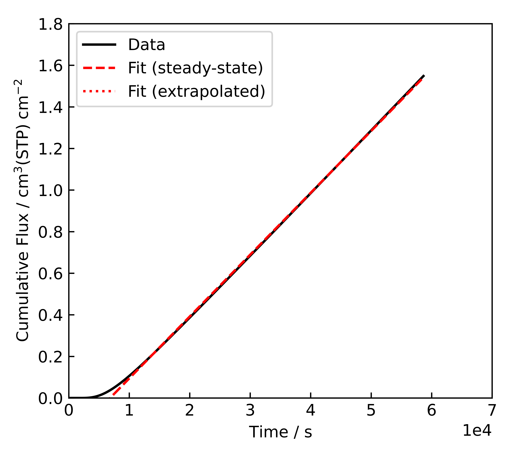
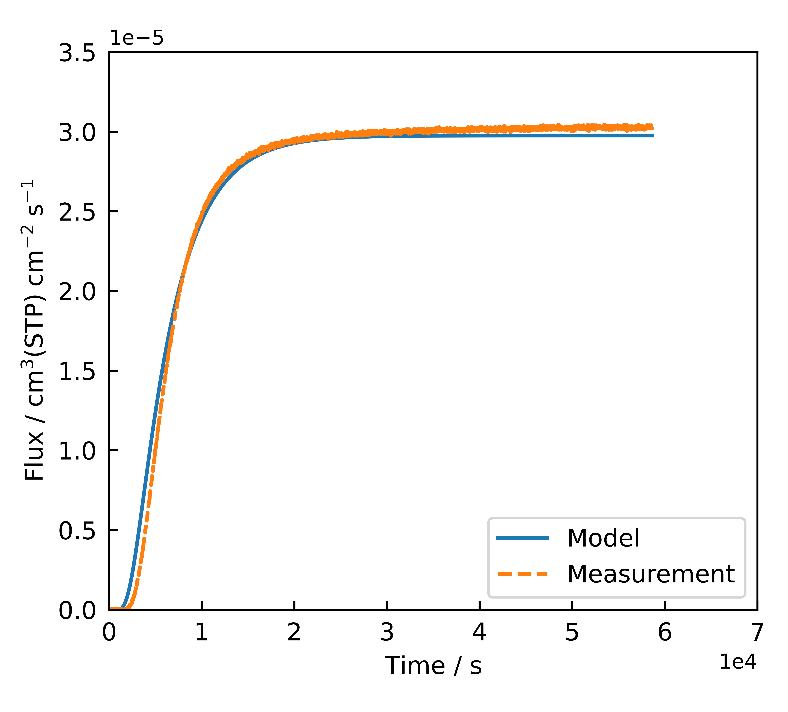
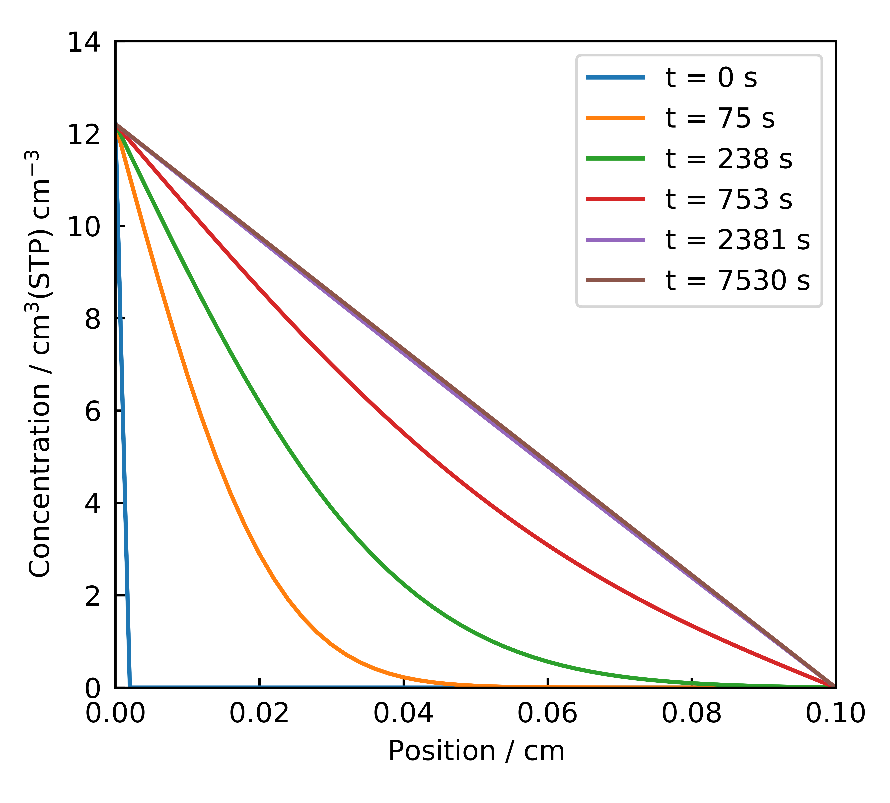
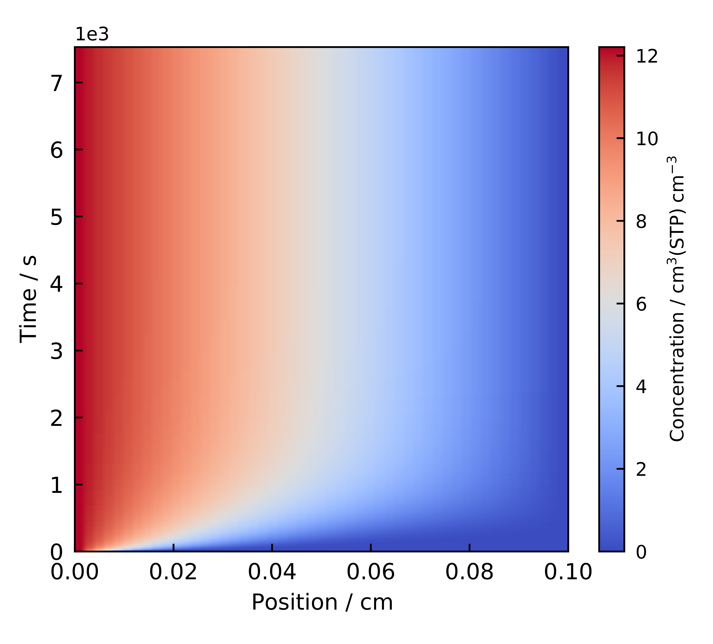

# Scientific Visualisation Implementation

This document explains how the scientific visualisations are implemented in the application. 

## Overview

The `visualisation.py` file provides specialised plotting functions to help interpret time lag analysis results. The visualisations in this application are implemented using Matplotlib and includes functions for generating the plots and another function for managing their visual style.

## Core Visualisation Functions

### 1. Time Lag Analysis Plot

The `plot_time_lag_analysis` function plots the cumulative flux (y-axis) against time (x-axis) which is used to calculate the time lag $(\theta)$, as previously shown in [`04-TimelagAnalysis-Implementation`](04-TimelagAnalysis-Implementation.md). This plot is important for validating the time lag analysis.

The core features are:

- Experimental data: The cumulative flux based on raw data is plotted as a function of time.
- Steady-state fit: A linear fit to the steady-state portion of the curve.
- Extrapolation: An extension of the steady-state line to earlier times. This provides visual determination for time lag $(\theta)$.

{: style="max-width:500px; height:auto;"}

*Figure 1: Example time lag analysis plot (`RUN_H_25C-100bar_9` data) produced by the `plot_time_lag_analysis` function.*

### 2. Flux Profile Comparison Plot

The `plot_flux_over_time` function plots flux (y-axis) against time (x-axis), comparing experimental data and theoretical predictions from the PDE solver. This demonstrates how well the model reproduces the data.

The core features are:

- Theoretical curve: Displayed as a continuous line to represent the model prediction.
- Experimental data: Plotted as points to show the raw measurements.

{: style="max-width:500px; height:auto;"}

*Figure 2: Example of flux comparison plot (`RUN_H_25C-100bar_9` data) produced by the `plot_flux_over_time` function.*

### 3. Concentration Profile Snapshot Plot

The `plot_concentration_location_profile` function plots multiple curves for the spatial distribution of gas concentration (y-axis) along the position within the membrane (x-axis), with each curve representing a **specific snapshot in time**. This helps with the intuitive understanding of the gas diffusion process within the membrane and validate that the PDE solver is correctly implementing the physical model.

The core features are:

- Multiple time points: Multiple curves reprent different time snapshot of concentration-time profile during the diffusion process.
- Spatial dimension: Displays concentration as a function of position within the membrane.

{: style="max-width:500px; height:auto;"}

*Figure 3: Example of the concentration profile snapshot plot (`RUN_H_25C-100bar_9` data) produced by the `plot_concentration_location_profile` function.*

#### 4. Concentration Profile Heatmap Plot

In contrast, the `plot_concentration_profile` function creates a 2D heatmap that visualises the gas concentration (colour intensity) across both membrane position (x-axis) and continuous time (y-axis). This provides a comprehensive overview of evolution of the concentration profile throughout the membrane over the full duration, complementing the discrete snapshots provided by `plot_concentration_location_profile`.

The core features are:

- Heatmap representation: Uses blue-to-red colour gradient to represent low-to-high gas concentration.
- Temporal and spatial dimensions: Displays the concentration evolution continuously over time and position within the membrane.

{: style="max-width:500px; height:auto;"}

*Figure 4: Example of the concentration profile hetmap plot (`RUN_H_25C-100bar_9` data) produced by the `plot_concentration_profile` function.*

## Consistent Plot Styling

### Implementation

The `set_plot_style` function in `utils.py` file maintains consistency across all Matplotlib plots generated by the application. This function is called at the beginning of each plotting routine to apply the standard style. 

The styling is done through modifying Matplotlib's [`rcParams`](https://matplotlib.org/stable/users/explain/customizing.html#customizing-with-dynamic-rc-settings), which dictates the style for any subsequently created figures within the current session. A snippet of the `rcParams` modification is provided below.

```python
    # Define consistent plot aesthetics
    plt.rcParams['font.size'] = 10
    plt.rcParams['font.family'] = 'sans-serif'
    plt.rcParams["mathtext.default"] = "regular"  # same as regular text
    # More rcParams modifications are provided in the code
```

### Benefits

Centralising styling decisions in a one function yield key benefits:

1. Consistency: All plots share the same visual style, creating a cohesive look and feel aligning with a chosen standards (e.g., tailored to a specific journal's style).
2. Maintainability: Style changes can be made in one location rather than throughout the codebase.


## Design Advantages

Using this approach of seprate plotting functions and a style-setting function offers several advantages:

1. Separation of concerns: Visualisation logic is separated from analysis code.
2. Consistent styling: All plots have a cohesive style.
3. Customisability: Functions accept optional figure and axes objects for further customization.
4. Integration: Seamlessly integrates with the analysis workflow.

This approach with independent plotting functions simplifies integration into the overall workflow and the GUI, which are discussed further in [`08-Application-Workflow`](08-Application-Workflow.md) and [`07-GUI-Implementation`](07-GUI-Implementation.md), respectively."
