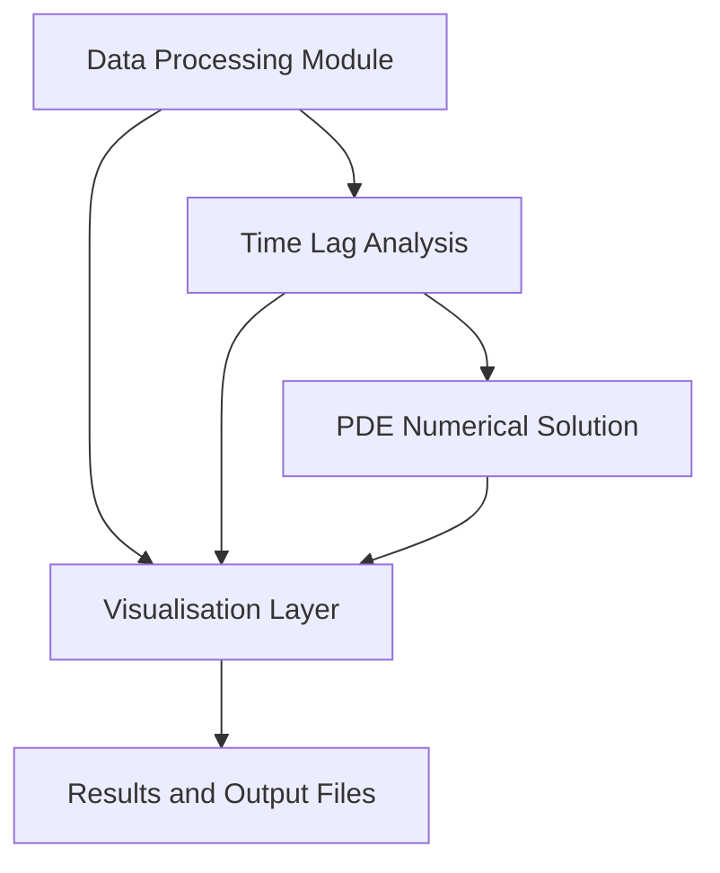

# Application Workflow

This document explains how the components of the Time Lag Analysis application integrate into a cohesive workflow for analysing gas permeation through membranes.

## The Central Workflow Function

### Workflow Overview

The application combines data processing, time lag analysis, PDE solving, and visualisation via the `time_lag_analysis_workflow` function in `time_lag_analysis.py`, creating a single and streamlined process. 

The `time_lag_analysis_workflow` function takes the following key parameters:

- `datapath`: Path to experimental data file
- `L_cm`: Membrane thickness
- `d_cm`: Membrane diameter
- `stabilisation_time_range`: Optional steady-state time range
- `display_plot`/`save_plot`/`save_data`: Output options

### Workflow Structure

The diagram below illustrates the interaction between the components inside the main `time_lag_analysis_workflow`:

### Core Workflow Stages

The `time_lag_analysis_workflow` encompasses the following stages:

1. Data Processing: Import and prepare experimental data.
2. Time Lag Analysis: Calculate transport parameters from steady-state data.
3. PDE Solution: Simulate theoretical concentration profile.
4. Visualisation: Create plots comparing experimental and theoretical results.
5. Results: Store calculated parameters and processed data.

### Component Functions

The main stages in `time_lag_analysis_workflow` consist of the following functions:

- Data Processing: `load_data`, `preprocess_data`, `identify_stabilisation_time` from `data_processing.py`.
- Time Lag Analysis: `time_lag_analysis` from `calculations.py`.
- PDE Solution: `solve_constant_diffusivity_model` from `calculations.py`.
- Visualisation: `plot_time_lag_analysis`, `plot_flux_over_time`, `plot_concentration_profile` from `visualisation.py`.

### Workflow Data Flow

The components within the `time_lag_analysis_workflow` exchange data as follows:

1. Data Processing → Time Lag Analysis

   - Processed experimental data with flux values, stabilisation time, and normalised measurements.

2. Time Lag Analysis → PDE Solution

   - Calculated diffusion coefficient, equilibrium concentration, and membrane thickness.

3. All Modules → Visualisation

   - Experimental data, transport parameters, and theoretical profiles.

## Workflow Benefits

Abstracting all implementation into a streamlined workflow yields the following benefits:

- Reproducibility: Complete analysis with a single function call.
- Consistency: Standardised processing pipeline.
- Validation: Automatic comparison of theory with experiment.
- Modularity: Easy to extend with new components.

The benefits of this end-to-end workflow are most apparent when building a GUI, which is detailed in [`07-GUI-Implementation`](07-GUI-Implementation.md).